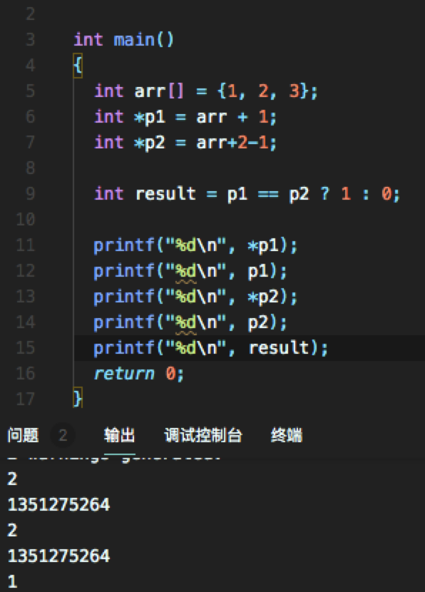

# 剑指offer学习总结

## c语言

### c语言多文件编程

[解决找不到标志符问题](https://stackoverflow.com/questions/58840157/how-to-fix-undefined-symbols-for-architecture-x86-64-in-c)

[CMake使用](https://blog.csdn.net/u012150179/article/details/17852273)

[多文件编程示例](https://blog.csdn.net/candcplusplus/article/details/7317472)

### 引用和指针

[区别](https://blog.csdn.net/boy_of_god/article/details/81022316)

### 指针的比较



### 浮点数的比较

[浮点数精度错误-知乎](https://www.zhihu.com/question/21175703)

[浮点数比较的写法](https://blog.csdn.net/jk110333/article/details/8902707)

[比较函数实例](./lib/doubleNumberEqual.h)

### 位运算的使用

```c
int number = 1; // 任意整数
bool isOddNumber = number & 1 == 1; // 按位与判断奇偶性
int numberHalf = number >> 1; // 右移一位 = 除二
int number2 = number << 1; // 左移一位 = 乘二
```

### 类型转化

[c语言中的char int转化问题](https://blog.csdn.net/mkc1989/article/details/39085711)

```c
// char -> int
char a = '1';
printf("%d", a - '0'); // 输出 1

// int -> char
char *itoa(int value, char *string, int radix);
```

## 算法相关

### 链表

#### 快慢指针

对于单链表数据结构上的问题，当我们用一个指针不能解决问题的时候，可以尝试用两个指针来遍历链表。
可以让其中一个指针遍历速度快一些，比如一次走两步，或者让他先在链表上走若干步。
可见以下几例：
 - [寻找链表中的倒数第k个节点](./cp3/findKthToTail.c)
 - [寻找链表中环的入口节点](./cp3/findEntryNodeOfLoop.c)

## cLion ide使用

### 调试时显示数组的所有内容

```shell script
    (MyType(*)[50])myType
```