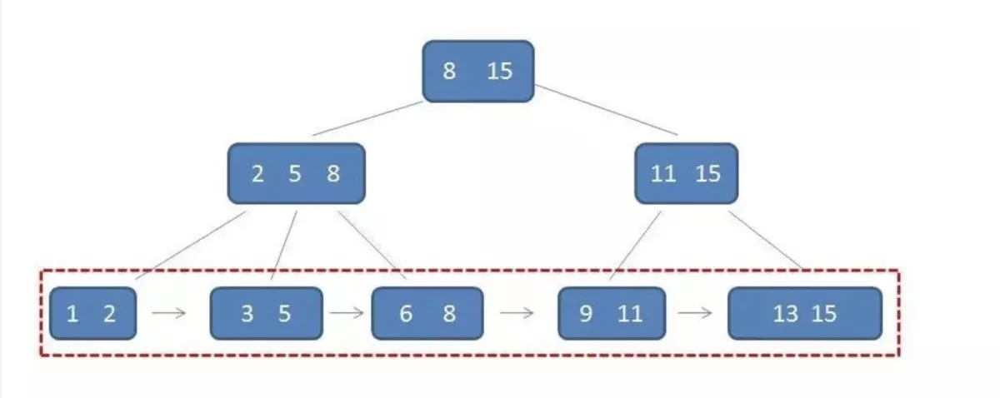

# 数据库
1. 数据库中的“存储程序”
2. 事物
3. 锁
4. 索引，实现及作用
5. 主键外键
6. 并发机制怎么实现？
7. 热备份和冷备份是啥

## 关系数据模型
### 基本定义
**域**：一组具有相同数据类型的值的集合

**笛卡尔积**：域上的一种集合运算。
在域 $D_1,D_2,...D_n$ 上的笛卡尔积为：
$D_1 \times D_2 \times ... \times D_n = \{ (d_1,d_2,...,d_n) | d_i \in D_i, i=1,2,...,n \}$
其中每一个元素 $(d_1,d_2,...,d_n)$ 叫做一个 **元祖**，元祖的每一个值 $d_i$ 叫做一个 **分量**。
笛卡尔积可以表示为一张二维表，表中每行对应一个元组，每列来自一个域。 

**关系**：$D_1 \times D_2 \times ... \times D_n$ 的子集叫做在域 $D_1,D_2,...D_n$ 上的关系。
关系是笛卡尔积的有限子集，所以关系是一张二维表。

**码**：若关系中的某一 **属性组** 的值能唯一标识一个元组，而其子集不能，则称该属性组为候选码（candidate key）。
若一个关系有多个候选码，则选定其中一个作为主码（primary key）

### 连接
从两个关系的笛卡尔积中选取属性间满足一定条件的元组。
一般链接操作从行的角度出发，**自然连接** 还需要舍弃重复的列。

**悬浮元组（dangling tuple）**：在连接中不满足条件的而被舍弃的元祖。
如果把悬浮元组也保留在结果关系中，而在其他属性上填空值（NULL），称这种链接为 **外连接（outer join）**；只保留左边关系R中的悬浮元组称为 **左外连接**；只保留右边关系S中的悬浮元组成为 **右外连接**。
### 视图

**基本表** 是本身独立存在的表，在关系数据库管理系统中一个关系对应一个基本表，一个或多个基本表对应一个存储文件，一个表可以带若干索引，索引也存放在存储文件中。
**视图** 是从一个或几个基本表（或视图）导出的表。数据库中**只存放视图的定义**，而不存放视图对应的数据，这些数据仍存放在原来的基本表中。
视图可以像基本表一样被查询、删除，但是对视图的更新操作有一定的限制。
#### 视图的作用
- 简化用户操作，例如隐藏基本表的连接操作建立视图
- 使用户以不同的方式看待同一数据
- 对重构数据库提供了一定程度的逻辑独立性，例如定义视图屏蔽基本表的结构改变，而不需修改应用程序
- 视图+权限控制，实现对机密数据的安全防护

### 数据库完整性
**实体完整性** 关系的主属性不能为空。
在create table中由primary  key定义。
现实世界中实体是可区分的，即它们含有某种唯一性标识。若主码取空值，则意味着存在某个不可区分的实体。

**参照完整性** 若属性F是基本关系R的外码，它与基本关系S的主码$K_s
$相对应(R不一定不等于S)，则对于R中的每个元组在F上的值必须等于S中某个元组的主码，或者为空。
在create table中由foreign key定义外码，用references短语指明外码参照哪些表的主码。
现实世界中的实体之间往往存在某种联系，关系模型中实体与实体间的联系都用关系来描述，这样就自然存在关系与关系间的引用。

#### 用户定义完整性
- 属性约束：NOT NULL、UNIQUE、CHECK
- 元组约束，不同属性之间的约束关系：CHECK
- 断言，涉及多个表或聚集操作的比较复杂的完整性约束

### 范式与规范化
关系模型要求关系必须是规范化（normalization）的，即要求关系必须满足一定的规范化条件，满足不同程度要求的为不同范式（normal form，NF）。
最基本的规范条件 1NF：关系中的每个分量必须是一个不可分的数据项。
一个低一级范式的关系通过模式分解（schema decomposition）可以转化为若干个高一级范式的关系模式的集合，这个过程称为规范化。

3NF和BCNF都是在函数依赖的条件下对模式分解所能达到的分离程度的测度。BCNF模式在函数依赖的范畴内已经完全分解，消除了插入异常和删除异常。
一个好的模式应当不会发生插入异常、删除异常和更新异常，数据冗余应尽可能少。
需要注意的是，并不是规范化程度越高模式就越好，必须结合应用环境和现实世界的具体情况合理选择数据模式。 
## 数据库设计
数据库设计的6个阶段

### 逻辑结构设计
即将概念结构设计阶段设计好的基本 **E-R图** 转换为与选用数据库管理系统所支持的 **关系模型**。主要问题是如何将实体间的联系转换为关系模式，如何确定这些关系的属性和码。
- 1:1 联系可以与任意一端对应的关系模式合并。
- 1:n 联系可以与n端对应关系模式合并，关系的码为n端实体的码。
- m:n 联系转换为一个关系模式，与该联系相连的各实体的码组成关系的码或关系码的一部分。

### 物理结构设计
确定存取方法以快速存取数据库中的数据。

**索引**：建立索引的目的是为了加快查询（连接、聚集函数）速度。
常用的查询包括等值、范围、排序，从数据结构的角度看，哈希索引只支持等值比较查询。
B+树是一颗`排序的多路平衡查找树`，且非叶子节点只起索引作用，信息只存储在叶子节点上。


易知，平局查找长度与树高成正比，与索引节点大小成反比，但是索引节点存储在硬盘上，其大小受到一次 I/O 的限制，不能无限制扩大。
> 为什么B+树比B树更适合作为数据库索引？
> 1. B+的非叶子节点不存储数据，因此占用空间更小，一次IO读取的节点更多，相对来说IO次数更少
> 2. B+树叶子节点有指针相连，支持范围查找，遍历也更方便（B树需要中序遍历）

**聚簇（cluster）**
聚簇索引并不是一种单独的索引类型，而是`一种数据存储方式`。指把属性相同的元组集中存放在连续的物理块中，可以减少 I/O 次数。
在 MYSQL 的 Innodb 存储引擎默认在关系的主属性上建立索引，且数据按主属性聚簇存放，因此对主键的查找非常快。在其他属性上添加的索引称为辅助索引，查找辅助索引得到主键值，然后查找主键索引得到数据。
> 为什么 Innodb 推荐自增 ID 作为主键?
> 1. 新数据的插入速度依赖于插入顺序，递增主键的插入时，为了维持B+树进行的节点分裂旋转代价最小
> 2. 更新主键代价很大，需要移动数据物理存储位置，自增ID本身无实际意义，可以从业务角度上避免更新主键
> 3. 单纯从业务角度看，可以很方便地保证主键唯一

[参考：MYSQL索引](https://www.cnblogs.com/jiawen010/p/11805241.html)
## 编程
SQL是非过程化的查询语言，缺少流程控制能力，难以实现应用业务中的逻辑控制。
### 过程化SQL
嵌入式SQL将SQL语句嵌入程序设计语言中，借助高级语言的控制功能实现过程化。过程化 SQL 是对 SQL 的扩展，使其增加了过程化语句功能。
#### 存储过程
**存储过程** 是由过程化 SQL 语句书写的过程，这个过程经编译和优化后存储在数据库服务器中，使用时只要调用即可。
优点：
1. 预先编译优化，使用时只需调用，因此运行效率高
2. 降低了客户机和数据库服务器的通信量。

## 查询优化
## 事物处理技术
### 事物
用户定义的一个数据库操作序列，这些操作要么全做，要么全不做，是一个不可分割的工作单位
- **原子性**（Atomicity）：事物是数据库的逻辑工作单位，事物中的操作要么都做，要么都不做。
- **一致性**（consistency）：事物的执行结果必须是使数据库从一个一致性状态变到另一个一致性状态。当数据库只包含成功事物提交的结果时，称数据库处于一致性状态。
- **隔离性**（Isolation）：并发执行的各个事物之间不能相互干扰。
- **持续性**（Durability）：已提交的事物，对数据库中数据的改变是永久的。

事物是恢复和并发控制的基本单位。

### 数据库恢复技术

恢复的基本原理：`冗余`，即数据库中任何一部分被破坏或不正确的数据可以根据存储在系统别处的冗余数据来重建。
建立冗余数据最常用的技术是`数据转储`和`登记日志文件`。
- **静态转储（冷备份）**：系统中无运行事务时进行转储。会降低数据库可用性。
- **动态转储（热备份）**：事务与转储并发进行。转储结束时后援副本的数据并不能保证正确有效。因此，必须把转储期间各事物对数据库的修改活动记录下来，建立日志文件。这样后援副本加上日志文件就能把数据库恢复到某一时刻的正确状态。

为保证数据库可恢复，必须先写日志文件，后写数据库。因为有可能在这两个操作之间发生故障，若先写了数据库，日志文件中没有记录就没法恢复这个修改。

### 并发控制
并发控制指用正确的方式调度并发操作，使一个用户事物的执行不受其他事物干扰，从而避免造成数据的不一致性，即保证事物的隔离性和一致性。
#### 数据不一致性
**写丢失**：两个事物修改同一个数据，导致其中一个事物的修改丢失（例如少减一）
**读脏数据**：事物T1对数据A修改且写回磁盘，A又被T2读取后，T1被撤销A恢复原值，则T2读取的就是“脏”数据
**不可重复读**：事物对数据两次读取之间数据发生了更新，导致前后读取结果不一致

#### 锁
**三级封锁协议**
1. 修改数据加排他锁，直到事物结束才释放，解决写丢失
2. 在一的基础上，读数据加分享锁，读完释放，解决读脏数据
3. 在一的基础上，读数据加分享锁，事物结束释放，解决不可重复读（不可重复读要求多次读取，故读完即释放的二级封锁协议不可解决）

**活锁**：事物永远等待（饥饿），可采用先来先服务策略解决。
**死锁**：详细见操作系统，数据库中采用死锁的检测（超时法、等待图法）和解除（撤销代价最小的事物）

#### 调度的正确性
显然串行调度是正确的。串行执行方式有多种结果，它们都是正确的。
**可串行化（serializable）调度**：事物的并发执行结果与按某一次序的串行执行结果相同。可串行化调度是正确调度。
#### 并发控制技术
1. **两段锁**（Two Phase Locking，2PL）协议：事务执行分为两个阶段，扩展（growing）阶段只能获取锁，收缩（shrinking）阶段只能释放锁。显然，2PL协议满足三级封锁协议，故可以解决数据不一致问题。然而，2PL并不要求事务必须一次将所有要使用的数据全部加锁，故有可能产生死锁。可采用多粒度封锁与意向锁提高并法度。
2. **时间戳**（Timestamp Ordering，TO）：给每个事务加上一个时间戳标记开始时间。发生冲突时，回滚具有较早时间戳的事务，以保证其他事务的正常执行，被回滚的事务被赋予新的时间戳重新执行。该方法对长事务不利，容易发生饥饿现象。
3. **乐观控制**（Optimistic Concurrency Control，OCC）：该协议认为事务执行时很少发生冲突，因此不对事务进行特殊的管制，而是让她自由执行，事务提交前再进行正确性检查。如果检查后发现该事务执行中出现过冲突并影响了可串行性，则拒绝提交并回滚。
4. **多版本并发控制**（MultiVersion Concurrency Control，MVCC）前面的两种并发控制机制确实能够从根本上解决并发事务的可串行化的问题，但是在实际环境中数据库的事务大都是只读的，读请求是写请求的很多倍，如果写请求和读请求之前没有并发控制机制，那么最坏的情况也是读请求读到了已经写入的数据，这对很多应用完全是可以接受的（不同应用的隔离级别要求不同）。每一个写操作都会创建一个新版本的数据，读操作会从有限多个版本的数据中挑选一个最合适的结果直接返回。

总结，依据冲突处理的时机（乐观程度），依次介绍基于锁（在事务开始前预防冲突）、基于时间戳（在事务执行中判断冲突）和基于验证（在事务提交时验证冲突）的事务并发控制机制。不同的实现适用于不同的workload，并发冲突小的workload，当然适合更乐观的并发控制方式。
MVCC可以解决只读事务和读写事务之间相互阻塞的问题，提高了事务的并发度，被大多数主流数据库系统采用。需要注意的是MVCC 并不是一个与乐观和悲观并发控制对立的东西，它能够与两者很好的结合以增加事务的并发量，在目前最流行的 SQL 数据库 MySQL 和 PostgreSQL 中都对 MVCC 进行了实现；但是由于它们分别实现了悲观锁和乐观锁，所以 MVCC 实现的方式也不同。

[数据库并发控制 - 锁和 MVCC](https://zhuanlan.zhihu.com/p/52106040)
[你真的懂MVCC吗？来手动实践一下？](https://zhuanlan.zhihu.com/p/90944467)
[数据库并发时如何保证数据的正确性？](https://www.zhihu.com/question/29322320/answer/44021825)
[浅析数据库并发控制机制](http://catkang.github.io/2018/09/19/concurrency-control.html)
## 其他问题
[常见面试题整理--数据库篇（每位开发者必备）](https://zhuanlan.zhihu.com/p/23713529)
### 数据库中的删除
- delete：删除表中的数据行
- truncate：删除表中的所有数据，不删除表
- drop：删除表
