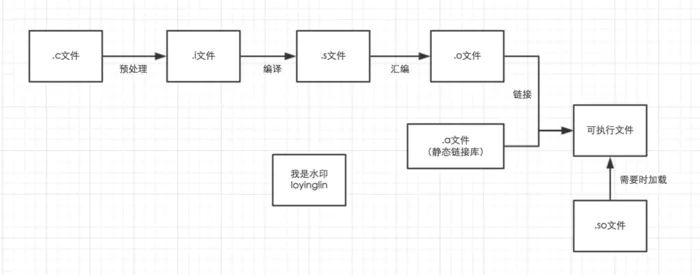
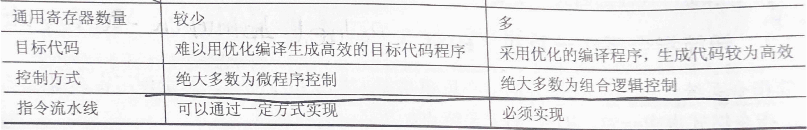

# 计算机组成原理
1. 中断的过程，断点，中断向量
2. Cache与主存映射方法，优缺点
3. cpu有几种设计方式
4. 南桥北桥
5. 补码加减的数学原理
6. 硬布线和微程序 那种容易变更？为什么

## 计算机系统概述
### 冯诺伊曼机
单指令流单数据流SISD
**存储程序**：将指令以代码的形式事先输入计算机的主存储器，然后按其在存储器中的首地址执行程序的第一条指令，以后就按该程序的规定顺序执行其他指令，直到程序执行结束。
CPU根据指令周期的不同阶段判断取出的是指令还是数据，取指阶段为指令，执行阶段为数据
### 寄存器
- MAR 地址寄存器：存放访存地址
- MDR 数据寄存器：主存和其他部件的中介机构，存放暂时要从存储器中读写的信息
- IR指令寄存器：当前正在执行的指令
- PC 程序计数器：下一跳指令地址
- PSW 程序状态寄存器：保留各类运算指令或测试指令的结果的各类状态信息，以表征系统运行状态

通用寄存器、PC对用户可见，MAR、MDR、IR对用户不可见
### C语言编译流程

## 存储系统
存储系统的层次结构主要体现在“Cache-主存”层次和“主存-辅存”层次，前者主要解决CPU和主存速度不匹配问题，后者主要解决存储系统容量问题。在这两个层次中，上一层中的内容都只是下一层内容的副本。
主存和cache之间的数据调动是由硬件自动完成的，对所有程序员均是透明的；而主存和辅存之间的数据调动则是由硬件和操作系统共同完成的，对应用程序员是透明的。
主存储器通过**数据总线**、**地址总线**和**控制总线**和CPU连接。
### 存储器扩容
- 并联全地址：位扩展，并联的芯片组同时输出，每一块输出数据的不同位
- 并联低位地址：字扩展，高位作为译码器输入片选信号，低位选择具体存储芯片中的字

同时扩展时，先并联扩位，片选再扩字。
用线选法也可以扩字，但会造成地址空间不连续，不能充分利用系统的地址空间。

为提高访存速度，可以使用多体低位交叉存储器（低位为体号，高位为体内地址，注意与高位选片的区别），可在不改变每个模块的存储周期的前提下，采用流水线的方式并行存取，提高存储器的带宽。地址体间连续，一段连续的指令被分散存储在多个模块中，故可多个模块并行操作。

### Cache-主存
#### 程序访问的局部性原理
- **时间局部性**：指在最近的未来要用到的信息，很可能是现在正在使用的信息，因为程序存在循环。
- **空间局部性**：指在最近的未来要用到的信息，很可能和现在正在使用的信息在存储空间上是临近的，因为指令通常是顺序存放、顺序执行的，数据一般也是以向量、数组、表等形式簇聚地存储在一起的。

#### Cache读策略（cache-主存映射）
| 名称 | 规则 | 内存地址格式 |优缺点|
| --- | --- | --- |---|
|  直接映射 | 主存数据只能装入cache中的唯一位置，若这个位置已有内容，则被替换出去 | <主存字块标记，Cache字块地址，字块内地址> |实现简单，空间利用率最低|
|  全相联映射 | 可以把主存数据块装入cache中的任意位置 | <主存字块标记，字块内地址> |空间利用率高，命中率高；地址变换速度慢，需要使用昂贵的按内容寻址的相联存储器进行地址变换|
| 组相联映射 | 将cache空间分成大小相同的组，主存的一个数据块可以装入一组中的任意位置，即组间直接映射，组内全相联。连续的主存块被映射到连续的组中。 | <主存字块标记，组地址，字块内地址> |是前两种的折中|

cache中每一块可以存放多个存储字，故需要字块内地址
主存字快标记指明cache中存放的是内存的哪一块副本，在根据字块号／组号查找时先找到cache块，再根据主存字块标记确定是否命中。即字块号／组号起到字块／组的选择作用，类比于字扩展选片。

主存-辅存相关内容见操作系统。
#### cache写策略

| 思想 | 写命中 | 写不命中 |
| --- | --- | --- |
| 以内存为中心 | 全写法（写直通法、write-through）：同时写cache和内存 | 非写分配（not-write-allocate）：只写内存，不写cache |
| 以cache为中心 | 写回法（write back）：只写cache，脏位判断修改 | 写分配法（write-allocate）：先加载块到cache，再写cache |
## 指令
指令（机器指令）是指计算机执行某种操作的命令，是计算机运行的最小功能单位。一条指令通常包括操作码和地址码两部分。操作码指出该指令应该执行什么性质的操作和具有何种功能；地址码给出被操作的信息（指令或数据）的地址。
### 寻址方式

### CISC／RISC

CISC：x86架构
RISC：ARM、MIPS
#### RISC的优势
1. 采用硬布线控制，没有控制存储器占用CPU面积
2. 更能提高运算速度。指令树、寻址方式和指令格式种类少，通用寄存器多，采用流水线技术，大多数指令能在一个时钟周期内完成
3. 指令系统简单，故便于设计，可降低设计成本，提高可靠性
4. 指令类型少，寻址方式少，有利于编译程序优化

### 指令执行周期
一个完整的指令执行周期包括以下4个周期：
取指周期-》间址周期-》执行周期-》中断周期
这4个周期都有CPU访存操作。取指周期为了取指令，间址周期为了取操作数有效地址，执行周期为了取操作数，中断周期为了保存程序断点。
CPU中设置4个标志触发器FE、IND、EX、INT对应不同的工作周期。
## cpu
### cpu设计
cpu控制单元控制一条指令的执行过程，实质上是依次执行一个确定的位操作序列的过程。按产生微操作控制信号方式的不同，控制器可以分为**硬布线控制器**和**微程序控制器**。
硬布线控制器的优点在于控制器的速度取决于电路延迟，所以速度快；缺点是由于**将控制部件视为专门产生固定时序控制信号的逻辑电路**，所以把用最少元件和取得最高速度作为设计目标，一旦设计完成，就不可能通过其他额外修改添加新功能。
微程序控制器的优点是同组合逻辑控制器相比，具有规整性、灵活性、可维护性等一系列优点；缺点是由于微程序控制器采用了存储程序原理，所以**每条指令都要从控制存储器中取一次**，影响速度。

#### 微程序控制器中的各种周期

### 中断
中断是在计算机执行程序的过程中，出现某些急需处理的异常情况或特殊请求，CPU暂时中止现行程序，转去执行对这些异常情况或特殊请求的进行处理，在处理完毕后CPU又自动返回到现行程序的断点处，继续执行原程序。
程序中断的作用有：
1. 实现CPU与IO并行工作
2. 处理硬件故障和软件错误
3. 实现人机交互
4. 实现多道程序、分时操作，多道程序的切换（时间片中断）
5. 实时处理的快速响应
6. 实现应用程序和操作系统（管态程序）的切换，软中断
7. 多处理机系统中各处理器之间的信息交流和任务切换

#### 中断类型

#### 中断处理过程

##### 中断隐指令
CPU响应中断后，经过某些操作，转去执行中断服务程序。这些操作是由硬件直接实现的，称为中断隐指令。中断隐指令不是一条真正的指令。操作如下：
**关中断-》保存断点-》引出中断服务程序**
其中引出中断服务程序的实质是：取出中断服务程序的入口地址并传送给程序计数器PC。故进入中断服务程序后，断点（即原PC值）已经改变，即保存断点要在进入中断服务程序之前。
##### 中断向量
不同的设备有不同的中断服务程序，每个中断服务程序都有一个入口地址，CPU必须找到这个入口地址，即**中断向量**，把系统中全部中断向量集中存放在存储器的某个区域内，这个存放中断向量的存储区就称为中断向量表，即中断服务程序入口地址表。

> *程序中断和调用子程序有什么区别？* 
> 两者的根本区别主要表现在服务时间和服务对象不一样。调用子程序由主程序中的调用指令确定的，其发生时间和位置固定已知。而程序中断一般由硬件电路产生，其发生时间是随机的。

##### 中断向量
## I/O系统
三种不同的I/O方式
- **程序查询方式**：CPU不停查询IO设备的状态，直到外设准备就绪。CPU与I/O串行工作，实现简单，效率低。
- **程序中断方式**：I/O设备准备好数据后发送中断请求，由CPU做中断处理传送数据。
- **DMA方式**：先由CPU做一些必要的预处理工作，启动I/O设备-》I/O设备准备好数据后，发送DMA请求占用总线-》数据传输结束后发出中断请求，由CPU做DMA结束处理。主存和外设之间拥有直接数据通路，数据传送不经过CPU，也就不需要保护、恢复CPU现场等繁琐操作。

中断适用于低速设备，如鼠标、键盘；DMA传送过程不需要CPU干预，故传输速率非常高，适合于高速外设的成组数据传送。

## 小问题
### 补码加减法的数学原理
所有编码系统的设计，都在追求连续性和唯一性。
原码，反码和补码的演化，就在不断提高整数编码的这两方面性能。
https://www.zhihu.com/question/30395946/answer/696377317
### 南桥北桥
北桥负责与CPU通信，并且连接高速设备（内存/显卡），并且与南桥通信；
南桥负责与低速设备（硬盘/USB）通信，时钟/BIOS/系统管理/旧式设备控制，并且与北桥通信。
### 字长

| 名称 |  含义|
| --- | --- |
| 机器字长 | 计算机能直接处理的二进制数据的位数，一般等于内部寄存器的大小，决定了计算机的运算精度 |  
| 指令字长 | 一个指令包含的二进制位数 |
| 存储字长 | 一个存储单元存储的二进制位数 |
| 数据字长 | 数据总线一次能并行传输信息的位数，可以不等于存储字长 |

指令字长一般取存储字长的整数倍，若指令字长等于存储字长的两倍，则需要两次访存来取出一条指令。
64位操作系统指特别为64位架构的计算机而设计的操作系统，它能够利用64位处理器的优势。但64位机器既可以使用64位操作系统，也可以使用32位操作系统。而32位处理器是无法使用64位操作系统的。