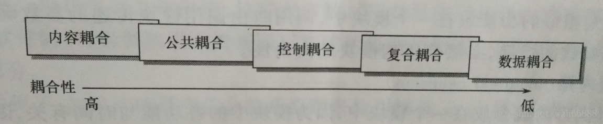

# 软件工程
1. 软件生命周期
2. 软件工程的三个模型：瀑布，增量，喷泉
3. bs，cs的区别
4. 模块是什么意思 区分模块的要素是什么？模块间的耦合度

## 软件危机
1. 开发成本和进度估计不准
2. 用户对已交付的软件不满意
3. 软件产品质量不佳
4. 软件可维护性差

## 软件生存周期

| 阶段 | 任务 | 产出 |
| --- | --- | --- |
| 可行性分析与计划 | 粗略地分析需求，确定经济、技术、社会可行性 | 问题定义报告、可行性研究报告、项目开发计划 |
| 需求分析 | 完整、准确、清晰、具体地分析需求 | 需求规格说明书 |
| 总体设计 | 设计软件结构、技术实现方案 | 总体设计说明书 |
| 详细设计 | 设计每个模块的算法和数据结构 | 详细设计说明书 |
| 实现（编码和单元测试） | 用具体语言实现设计，并进行模块测试 | 程序清单、单元测试报告 |
| 集成测试 | 将经过单元测试的模块组装起来进行测试，使软件达到预定要求 | 测试报告 |
| 确认测试 | 用户按照需求规则说明书进行测试 | 测试报告 |
| 使用与维护 | 通过维护使系统持久满足用户要求 |  |

## 常用软件过程模型
实际进行软件开发时，软件规模、类型、开发环境及技术方法等因素会影响到阶段划分，及各阶段的执行顺序，形成不同生存周期模型，又称过程模型。

### 瀑布模型
特点：
1. 阶段具有顺序性和依赖性：前一个阶段结束后下一个阶段才开始，前一个阶段的输出文档作为下一个阶段的输入文档
2. 推迟实现观点：推迟物理实现，保证前期工作扎实
3. 质量保证观点：要求每个阶段都产出完整、准确的文档，并进行文档评审

缺点：
缺乏灵活性，无法解决需求不明确问题，用户不经过实践提出完整准确的需求是不切实际的，而客户要等到开发周期的晚期才能看到程序运行的测试版本，此时发现错误改正代价很大
### 快速原型模型
所谓快速原型是快速建立起来的可以在计算机上运行的程序，它所能完成的功能往往是最终产品能完成的功能的一个子集。快速原型的本质是“快速”，开发人员应该尽可能快地建造出原型系统，以加速软件开发过程，节约软件开发成本。原型的用处是获知用户的真正需求，一旦需求确定了，原型系统将被抛弃。
### 增量模型
将软件产品作一系列增量构件设计、编码、集成和测试。使用增量模型时，第一个增量构件往往实现软件的基本需求，提供最核心的功能。
瀑布和快速原型模型时一次把满足所有需求产品提交给用户，而增量模型是分批向用户提交产品
优点：
1. 较短时间内就可向用户提交可用产品
2. 用户有充裕时间学习适应产品
3. 对软件结构设计要求较高，方便向现有产品加入新构件

### 喷泉模型
面向对象生命周期模型，体现迭代和无缝特性。
迭代：求精，系统某部分常被重复工作多次，相关功能在每次迭代中逐渐加入演进系统。
无缝：分析、设计、编码各阶段不存在明显边界。
优点：
无缝，可同步开发，提高开发效率，节省开发时间
缺点：
可能随时加各种信息，需求和资料（不断迭代），文档管理比较难。

## 模块
[参考资料：【软件工程】模块](https://blog.csdn.net/wzh66888/article/details/79587105)

`模块` 又称 `构件` 一般指用一个名字调用的相邻程序元素序列。
`模块化` ：按适当的原则把软件划分为一个个较小的、相关而又相对独立的模块。

模块分解的目的是将系统“分而治之”，以降低问题的复杂性，使软件结构清晰，易阅读、易理解、易于测试和调试，因而也有助于提高软件的可靠性。
但并非模块分的越小越好，因为模块数越多，模块之间的接口越多，模块之间的复杂度和工作量增加。显然，每个软件系统都有一个分解的最佳模块数M。选择分解的最佳模块数，可以在降低问题复杂度的同时获得较低的成本。

### 三要素

| 名称 | 意义 |
| --- | --- |
| 功能 | 即指该模块实现什么功能，做什么事情。 |
| 逻辑 | 即描述该模块内部怎么做。 |
| 状态 | 即该模块使用时的环境和条件。 |

### 独立性
具有独立性的模块应该是具有专一功能，模块之间无过多的相互作用的模块。
模块独立性的度量标准是两个定性准则：耦合性和内聚性。
#### 耦合
耦合性是指软件结构中模块相互连接的紧密程度，是模块间相互连接性的度量

1. **内容耦合**：一个模块直接访问另一个模块的内部数据，一个模块不通过正常入口转到另一模块的内部，一个模块有多个入口或者两个模块有部分代码重叠。
2. **公共耦合**：若干模块访问一个公共的数据环境，则它们之间的耦合称为公共耦合。公共环境可为全局数据结构、共享的通信区、内存的公共覆盖区等。显然，公共数据区的变化，将影响所有公共耦合模块，严重影响模块的可靠性和可适应性，降低软件的可读性。
3. **控制耦合**：一个模块传递给另一个模块的信息是用于控制该模块内部逻辑的控制信号。显然，对被控制模块的任何修改，都会影响控制模块。
4. **复合耦合**：一个模块传送给另一个模块的参数是一个复合的数据结构，例如，包含几个数据单项的记录。
5. **数据耦合**：一个模块传送给另一个模块的参数是一个单个的数据项或者单个数据项组成的数据。

#### 内聚
内聚性表示一个模块内部各种数据和各种处理之间联系的紧密程度，它是从功能的角度来度量模块内的联系。

## cs／bs
cs：主要指的是传统的桌面级的应用程序，基于客户端的应用。
交互型更强（快捷键操作等），开发成本更高
bs：主要指的是web应用程序，基于浏览器的应用。

## 测试
- **黑盒测试**：意味着测试要在软件的**接口处**进行。这种方法是把测试对象看做一个黑盒子,测试人员完全不考虑程序内部的逻辑结构和内部特性，只依据程序的需求规格说明书,检查程序的功能是否符合它的功能说明。因此黑盒测试又叫**功能测试**。
- **白盒测试**：对软件的过程性细节做细致的检查。这种方法是把测试对象看做一个打开的盒子，它允许测试人员利用程序内部的逻辑结构及有关信息，设计或选择测试用例，对程序的**所有逻辑路径**进行测试，通过在不同点检查程序状态，确定实际状态是否与预期的状态一致。因此白盒测试又称为**结构测试**。白盒测试主要是想对程序模块进行检查。
